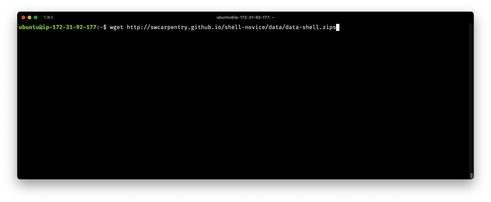

-----------------------

# Introduction to AWS and Unix

*by Jose Hector Galvez, Zhibin Lu & Rob Syme*

---

## Contents:

1. [Logging into AWS ](#aws_login)

2. [Introduction to the command line](#command_line_intro)

    2.1 [How commands work](#commands)

    2.2 [Basic navigation](#navigation)

    2.3 [Standard in /Standard out](#std_in_out)

    2.4 [Asking for help](#help)

3. [File manipulation](#file_manip)

    3.1 [Types of files](#filetypes)

    3.2 [Reading text files](#read_files)

    3.3 [Editing files](#file_edit)

    3.4 [Copying, renaming, and moving files](#cp_mv)

    3.5 [Introduction to permissions](#chmod)

4. [Searching and sorting files](#search_sort)

5. [Putting it all together](#conclusion)

-----------------------

## 1. Logging into AWS

#### Description of the lab:
This section will show students how to login to AWS and create an instance.

-----------------------

## 2. Introduction to the command line

### Description of the lab:
This section will show students the basics of the command line, with a focus on navigation.

### 2.1 How commands work

What do all the options in the command mean?

  

**Solution** (click here)
  

---

### 2.2 Basic navigation

What do all the options in the command mean?

  

**Solution** (click here)
  

---

### 2.3 Standard In /Standard Out

What do all the options in the command mean?

  

**Solution** (click here)
  

---

### 2.4 Asking for help

What do all the options in the command mean?

  

**Solution** (click here)
  

-----------------------

## 3. File manipulation

### Description of the lab:
This section will show students how to manipulate files, including reading, editing, and renaming text files.

### 3.1 Types of files

What do all the options in the command mean?

  

**Solution** (click here)
  

---

### 3.2 Reading text files

What do all the options in the command mean?

  

**Solution** (click here)
  

---

### 3.3 Editing files

What do all the options in the command mean?

  

**Solution** (click here)
  

---

### 3.4 Copying, renaming, and moving files

What do all the options in the command mean?

  

**Solution** (click here)
  

---

### 3.5 Introduction to permissions

-----------------------

## 4. Searching and sorting files

### Description of the lab:
This section will show students how to search for files and in files.

-----------------------

## 5. Putting it all together

### Description of the lab:
This section will show students how the basic concepts fit together and in the context of bioinformatics.
